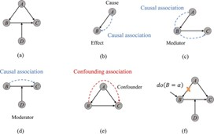

High Level – Causal Inference
============================

2.3 High Level – Causal Inference
---------------------------------

We get our best APIs from top-down thinking closely tied to the problem domain.

Here are three functions that let us fully immerse our brains in the world of causal inference:

.. code-block:: python

    "Rules for Causal Inference"
    from statistics import correlation, linear_regression
    from random import normalvariate

    def independent_variable(mean=0.0, stdev=1.0, n=10_000):
        return [normalvariate(mean, stdev) for i in range(n)]

    def caused_by(*variables):
        "Create a causal descendent"
        return [sum(column) for column in zip(*variables, strict=True)]

    def controlled_for(Y, X):
        "Y residuals from a X/Y linear model."
        m, b = linear_regression(X, Y)
        return [y - m*x + b for x, y in zip(X, Y)]

Here we put it to work. Notice that the high-level thinking doesn't feel like programming at all:

.. code-block:: python

    "Rules for Causal Inference"
    # https://pedermisager.org/blog/seven_basic_rules_for_causal_inference/
    
    # Rule 1: Independent variables are not correlated
    A = independent_variable()
    B = independent_variable()
    print(correlation(A, B))

    # Rule 2: Causal influence creates correlation
    A = independent_variable()
    B = caused_by(A, independent_variable())
    print(correlation(A, B))

    # Rule 2 with mediation
    A = independent_variable()
    M = caused_by(A, independent_variable())
    B = caused_by(M, independent_variable())
    print(correlation(A, B))

    # Rule 3: Confounding creates correlation
    C = independent_variable()
    A = caused_by(C, independent_variable())
    B = caused_by(C, independent_variable())
    print(correlation(A, B))

    # Rule 5: Controlling for a confounder blocks
    # correlation arising from that confounder
    C = independent_variable()
    A = caused_by(C, independent_variable())
    B = caused_by(C, independent_variable())
    X = controlled_for(B, C)
    Y = controlled_for(A, C)
    print(correlation(X, Y))

    # Rule 6: Controlling for a mediator blocks
    # correlation arising from the mediated causal effect
    A = independent_variable()
    M = caused_by(A, independent_variable())
    B = caused_by(M, independent_variable())
    X = controlled_for(B, M)
    Y = controlled_for(A, M)
    print(correlation(X, Y))

    # Rule 7: Controlling for a collider
    # leads to correlation
    A = independent_variable()
    B = independent_variable()
    D = caused_by(A, B, independent_variable())
    X = controlled_for(B, D)
    Y = controlled_for(A, D)
    print(correlation(X, Y))

