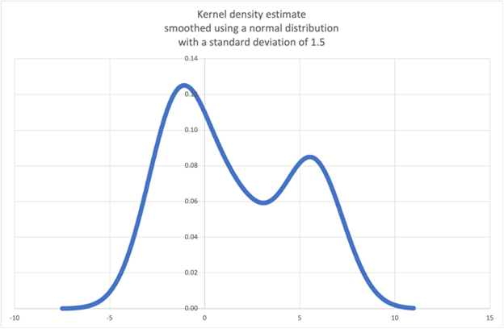

High Level – Kernel Density Estimation
====================================

2.5 High Level – Kernel Density Estimation
------------------------------------------

Data smoothing is an almost magical tool that lets you reason about continuous probability distributions based on just a small set of samples.

Starting with just these six discrete samples:

.. code-block:: python

    sample = [-2.1, -1.3, -0.4, 1.9, 5.1, 6.2]

We can infer this probability density function:

The code quickly gets us out of the Python world and into the world of data visualization:

.. code-block:: python

    "Kernal density estimation (data smoothing)."
    from statistics import NormalDist
    from random import choice, random

    def kde_normal(data, h):
        "Create a continuous probability distribution from discrete samples."
        # Smooth the data with a normal distribution kernel scaled by h.
        K_h = NormalDist(0.0, h)

        def pdf(x):
            'Probability density function. P(x <= X < x+dx) / dx'
            return sum(K_h.pdf(x - x_i) for x_i in data) / len(data)

        def cdf(x):
            'Cumulative distribution function. P(X <= x)'
            return sum(K_h.cdf(x - x_i) for x_i in data) / len(data)

        def rand():
            'Random selection from the probability distribution.'
            return choice(data) + K_h.inv_cdf(random())

        return pdf, cdf, rand

    if __name__ == '__main__':
        # https://en.wikipedia.org/wiki/Kernel_density_estimation#Example
        sample = [-2.1, -1.3, -0.4, 1.9, 5.1, 6.2]
        pdf, cdf, rand = kde_normal(sample, h=1.5)
        xarr = [i/10 for i in range(-75, 110)]
        yarr = [pdf(x) for x in xarr]
        for x, y in zip(xarr, yarr):
            print(f'{x:.3f}, {y*100:.3f}')
