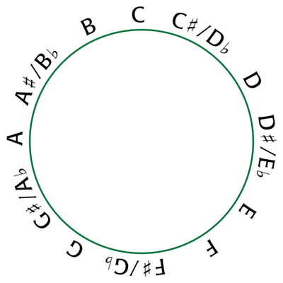

High Level – Music Theory
=======================

2.6 High Level – Music Theory
-----------------------------

Music theory is best explored through the language of the problem domain.

Here is a small toolset for bridge between standard music theory and the MIDI computer world:

.. code-block:: python

    from itertools import cycle
    from pprint import pp

    middle_c_octave = 4 # Varies by manufacturer
    middle_c = 60 # https://newt.phys.unsw.edu.au/jw/notes.html
    tuning_a = 69 # https://djip.co/blog/logic-studio-9-midi-note-numbers
    tuning_a_freq = 440.0 # https://en.wikipedia.org/wiki/A440_(pitch_standard)

    notes = ('C', 'C#', 'D', 'D#', 'E', 'F', 'F#', 'G', 'G#', 'A', 'A#', 'B')
    interval_abbrevs = ('P1', 'm2', 'M2', 'm3', 'M3', 'P4', 'd5', 'P5',
                        'm6/A5', 'M6', 'm7', 'M7', 'P8')
    interval_names = ('perfect unison', 'minor 2nd', 'major 2nd',
                      'minor 3rd', 'major 3rd', 'perfect 4th', 'no name / diminished 5th', 'perfect 5th',
                      'minor 6th / augmented fifth', 'major 6th', 'minor 7th', 'major 7th', 'perfect octave')
    diatonic_numbers = ('I', 'ii', 'iii', 'IV', 'V', 'vi', 'vii')
    degrees = ('tonic', 'supertonic', 'mediant', 'subdominant',
               'dominant', 'submediant', 'leading tone')

    scales = dict(
        major_scale = 'WWHWWWH',
        minor_scale = 'WHWWHWW',
        minor_harmonic_scale = 'WHWWHWH',
        minor_melocic_scale_up = 'WHWWHHW', # XXX need to verify
    )

    keyboard = '''\
    B# C Dbb
    Bx C# Db
    Cx D Ebb
    D# Eb Fbb
    Dx E Fb
    E# F Gbb
    Ex F# Gb
    Fx G Abb
    G# Ab
    Gx A Bbb
    A# Bb Cbb
    Ax B Cb
    '''.splitlines()

    def midi_to_freq(note_number):
        semitones = note_number - tuning_a
        return tuning_a_freq * 2.0 ** (semitones / 12.0)

    def midi_to_note(note_number):
        note = notes[note_number % 12]
        octave = (note_number - middle_c) // 12 + middle_c_octave
        return note, octave

    fifths = [midi_to_note(i)[0] for i in range(-7, 77, 7)]

    if __name__ == '__main__':
        for i in range(21, 75, 7):
            print(midi_to_note(i), midi_to_freq(i))
        pp(list(zip(interval_abbrevs, interval_names)))
        pp(list(zip(diatonic_numbers, degrees)))
        print(fifths)

    # Explore the 12 semitones. Build up their names, small fractions, and equal tempered frequency ratios:
    >>> from fractions import Fraction
    >>> for step in range(13):
    ...     r = 2 ** (step / 12)
    ...     f = Fraction(r).limit_denominator(10)
    ...     print(interval_abbrevs[step], f, r, sep='\t')
    ...
    P1 1 1.0
    m2 11/10 1.0594630943592953
    M2 9/8 1.122462048309373
    m3 6/5 1.189207115002721
    M3 5/4 1.2599210498948732
    P4 4/3 1.3348398541700344
    d5 7/5 1.4142135623730951
    P5 3/2 1.4983070768766815
    m6/A5 8/5 1.5874010519681994
    M6 5/3 1.681792830507429
    m7 16/9 1.7817974362806785
    M7 17/9 1.8877486253633868
    P8 2 2.0

    # Origin of the twelve semitones from successive fifths
    >>> 1.5 ** 12 # Approximately a power of two
    129.746337890625
    
    # Music theory in a nutshell:
    # Since 2 ** 7 is about 1.5 ** 12,
    # Seven octaves is about twelve perfect fifths

Explore the 12 semitones. Build up their names, small fractions, and equal tempered frequency ratios:

.. code-block:: python

    >>> from fractions import Fraction
    >>> for step in range(13):
    ...     r = 2 ** (step / 12)
    ...     f = Fraction(r).limit_denominator(10)
    ...     print(interval_abbrevs[step], f, r, sep='\t')
    ...
    P1         1       1.0
    m2         11/10   1.0594630943592953
    M2         9/8     1.122462048309373
    m3         6/5     1.189207115002721
    M3         5/4     1.2599210498948732
    P4         4/3     1.3348398541700344
    d5         7/5     1.4142135623730951
    P5         3/2     1.4983070768766815
    m6/A5      8/5     1.5874010519681994
    M6         5/3     1.681792830507429
    m7         16/9    1.7817974362806785
    M7         17/9    1.8877486253633868
    P8         2       2.0

    #Origin of the twelve semitones from successive fifths:
    >>> 1.5 ** 12  # Approximately a power of two
    129.746337890625

Music theory in a nutshell:
~~~~~~~~~~~~~~~~~~~~~~~~~~~

Seven octaves is about twelve perfect fifths:

.. code-block:: python

    # Since 2 ** 7 is about 1.5 ** 12,
    # Seven octaves is about twelve perfect fifths.
