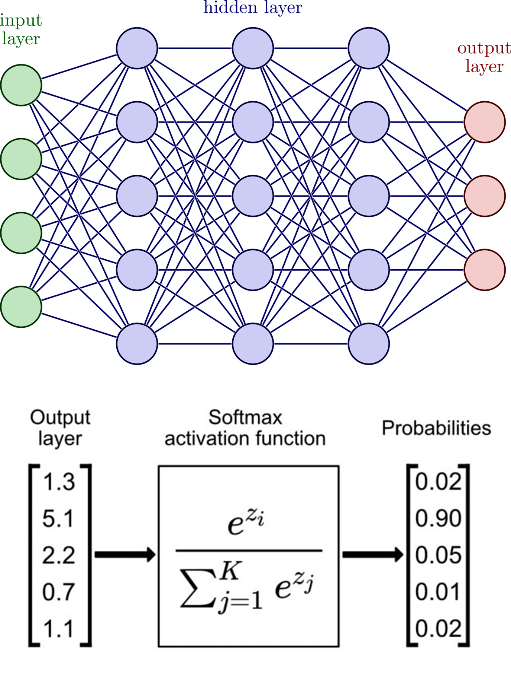

High Level – Neural Net
=======================

Here we build a simple multilayer neural network.

Notice how all of the functions are built exclusively in the problem domain, and we build up the net from first principles:

.. code-block:: python

    "High level API for a multilayer neural net."
    from math import sumprod, exp, tanh

    def perceptron(inputs, weights):
        biased_inputs = list(inputs) + [1]
        return tanh(sumprod(biased_inputs, weights))

    def compute_layer(inputs, WeightsT):
        return [perceptron(inputs, weights) for weights in WeightsT]

    def softmax(inputs):
        positives = [exp(x) for x in inputs]
        total = sum(positives)
        return [p / total for p in positives]

    def net(inputs, model):
        layer = inputs
        for WeightsT in model:
            layer = compute_layer(layer, WeightsT)
        return softmax(layer)

Note how the functions fully express our top-level mental images:

Here is the same code in a more functional style:

.. code-block:: python

    "High level API for a multilayer neural net."
    from math import sumprod, tanh
    from itertools import chain
    from functools import partial, reduce
    from math import exp

    def perceptron(inputs, weights):
        return tanh(sumprod(chain(inputs, [1.0]), weights))

    def compute_layer(inputs, WeightsT):
        return list(map(partial(perceptron, inputs), WeightsT))

    def softmax(inputs):
        positives = list(map(exp, inputs))
        total = sum(positives)
        return [p / total for p in positives]

    def net(inputs, model):
        return softmax(reduce(compute_layer, model, inputs))

Here is the some test code to demonstrate it:

.. code-block:: python

    "High level API for a multilayer neural net."

    from math import sumprod, exp, tanh
    from neural_net import perceptron, compute_layer, softmax, net

    from random import uniform
    from itertools import pairwise
    from pprint import pprint

    def rand_mat(m, n):
        'Transform m_inputs to n_outputs. Return transposed (n x m)'
        return [[uniform(-1, 1) for i in range(m)] for j in range(n)]

    def rand_model(*sizes):
        return [rand_mat(m+1, n) for m, n in pairwise(sizes)]

    inputs = [0.1, 0.4, 0.9, 0.2, 0.3, 0.9, 0.7, 0.5, 0.1, 0.3, 0.5]
    sizes = [11, 500, 120, 10]
    model = rand_model(*sizes)
    print(net(inputs, model))  # 582 usec for 67_300 mults at 8.64 ns each

    # 3blue1brown network for digit recognition
    digit_model = rand_model(784, 16, 16, 10)

